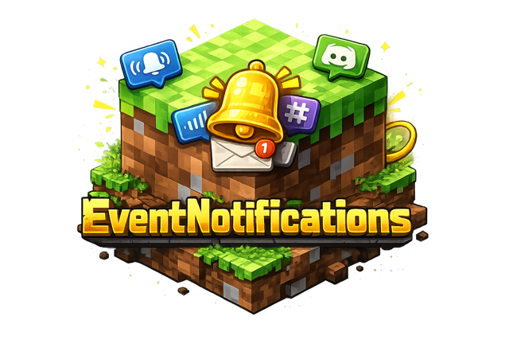

<p align="center">
  
</p>

<p align="center">
  <a href="https://github.com/jeppestaerk/Minecraft-Plugin-EventNotifications/releases/latest"></a>
  <a href="https://github.com/jeppestaerk/Minecraft-Plugin-EventNotifications/blob/main/LICENSE"></a>
</p>

<p align="center">
  
  
  
</p>

# Minecraft EventNotifications mod/plugin

***Real-time server event notifications for Minecraft*** — supports ntfy, Discord, Slack, and webhooks.

## Supported Loaders

| Loader | Minecraft Version | Status |
|--------|-------------------|--------|
| Fabric | 1.21.11+          | Stable |
| NeoForge | 1.21.11+          | Stable |
| Paper/Spigot/Bukkit | 1.21.11+          | Stable |

## Features

### Supported Events

| Event                | Description |
|----------------------|-------------|
| Player Connect       | Player joined the server |
| Player Disconnect    | Player left the server |
| Player Death         | Player died (includes death message) |
| Player Advancement   | Player earned an advancement |
| Player Kicked        | Player was kicked |
| Player Banned        | Player was banned |
| Player Pardoned      | Player was unbanned |
| Player OP            | Player was given operator status |
| Player De-OP         | Player's operator status was removed |
| Player Whitelisted   | Player was added to whitelist |
| Player Unwhitelisted | Player was removed from whitelist |
| Server Startup       | Server has started |
| Server Shutdown      | Server is stopping |
| Server Whitelist On  | Server whitelist was enabled |
| Server Whitelist Off | Server whitelist was disabled |

### Notification Targets

- **ntfy** - Push notifications via [ntfy.sh](https://ntfy.sh) or self-hosted
- **Discord** - Webhook notifications with optional embeds
- **Slack** - Webhook notifications with optional attachments
- **Generic Webhook** - Configurable HTTP POST/PUT requests

## Installation

### Fabric

1. Download `EventNotifications-Fabric-x.x.x.jar` from [Releases](../../releases)
2. Place the JAR in your `mods/` folder
3. Start the server to generate config files
4. Configure `config/eventnotifications/config.yml`

### NeoForge

1. Download `EventNotifications-NeoForge-x.x.x.jar` from [Releases](../../releases)
2. Place the JAR in your `mods/` folder
3. Start the server to generate config files
4. Configure `config/eventnotifications/config.yml`

### Paper/Spigot/Bukkit

1. Download `EventNotifications-Paper-x.x.x.jar` from [Releases](../../releases)
2. Place the JAR in your `plugins/` folder
3. Start the server to generate config files
4. Configure `plugins/EventNotifications/config.yml`

## Configuration

### Main Config (`config.yml`)

```yaml
general:
  # Server name for notifications (uses MOTD if not set)
  server_name: "My Server"
  # Enable in-game commands (/eventnotifications) for managing targets
  commands_enabled: true

targets:
  # ntfy target
  ntfy_main:
    type: ntfy
    enabled: true
    server: "https://ntfy.sh"
    topic: "my-minecraft-server"
    # Optional authentication
    auth_type: bearer
    auth_token: "tk_your_token_here"

  # Discord webhook
  discord_main:
    type: discord
    enabled: true
    webhook_url: "https://discord.com/api/webhooks/..."
    use_embeds: true

  # Slack webhook
  slack_main:
    type: slack
    enabled: true
    webhook_url: "https://hooks.slack.com/services/..."

  # Generic webhook
  webhook_custom:
    type: webhook
    enabled: true
    url: "https://example.com/webhook"
    method: "POST"
```

### Event Templates (`templates/default.yml`)

Customize notification messages with placeholders:

```yaml
server_startup:
  enabled: true
  title: "{{server_name}} - Started"
  message: "Server is now online!"
  color: "#2ecc71"          # Discord embed color
  tags: "white_check_mark"  # ntfy emoji tags
  priority: "high"          # ntfy priority

player_connect:
  enabled: true
  title: "{{server_name}} - Player Joined"
  message: "**{{player_name}}** joined the server"
  color: "#3498db"
  tags: "video_game,arrow_right"
  priority: "default"

player_death:
  enabled: true
  title: "{{server_name}} - Player Died"
  message: "{{death_message}}"
  color: "#e74c3c"
  tags: "skull"
  priority: "default"
```

### Available Placeholders

| Event | Placeholders |
|-------|--------------|
| All events | `{{server_name}}` |
| Player events | `{{player_name}}`, `{{player_uuid}}` |
| player_death | `{{death_message}}` |
| player_advancement | `{{advancement_title}}`, `{{advancement_description}}`, `{{advancement_message}}` |
| player_kicked | `{{reason}}` |
| player_banned | `{{banned_by}}`, `{{reason}}` |

## Commands

Manage notification targets in-game with the `/eventnotifications` command (requires OP or `eventnotifications.admin` permission):

| Command | Description |
|---------|-------------|
| `/eventnotifications reload` | Reload configuration from disk |
| `/eventnotifications list` | List all targets with their status |
| `/eventnotifications info <name>` | Show details for a target |
| `/eventnotifications enable <name>` | Enable a target |
| `/eventnotifications disable <name>` | Disable a target |
| `/eventnotifications set <name> <property> <value>` | Change a target property |
| `/eventnotifications message <name> <message>` | Send a test message to a target |

## License

MIT

## Contributing

Contributions are welcome! Please open an issue or pull request.
